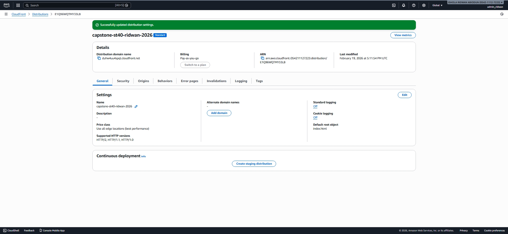
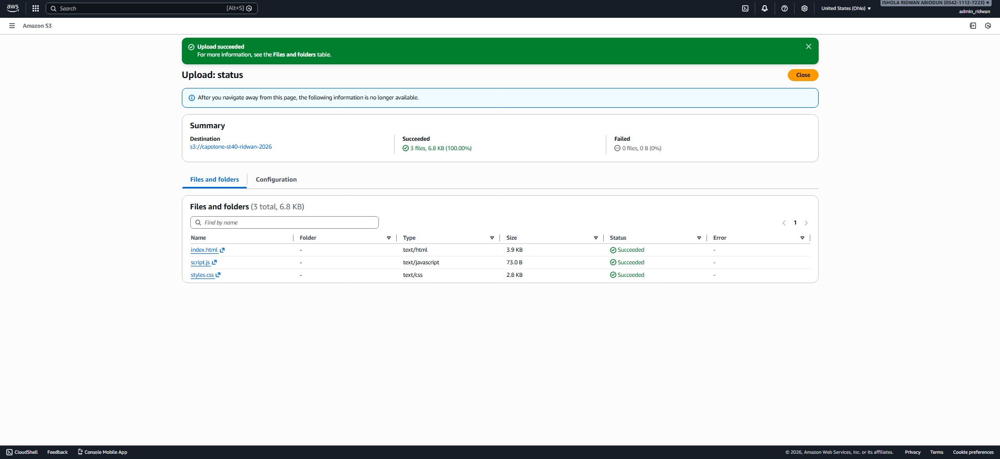

# AWS S3 + CloudFront Static Website (Capstone Project)

## Overview

This project demonstrates how to deploy a static website using:

- Amazon S3 (object storage)
- Amazon CloudFront (global content delivery network)
- Secure bucket access via CloudFront Origin Access Control (OAC)

The website is fully deployed and accessible through a CloudFront distribution.

---

## Architecture

User → CloudFront → S3 Bucket → Static Files

CloudFront handles:
- Global caching
- Secure access to S3
- HTTPS delivery

S3 stores:
- index.html
- styles.css
- script.js

---

## Deployment Steps

1. Created an S3 bucket
2. Uploaded static website files
3. Configured bucket policy for CloudFront access
4. Created CloudFront distribution
5. Set default root object to `index.html`
6. Verified global access via CloudFront URL

---

## Screenshots

### 1. S3 Website Endpoint

### 2. CloudFront Distribution

### 3. Successful File Upload

---

## Tech Stack

- HTML
- CSS
- JavaScript
- Amazon S3
- Amazon CloudFront

---

## Author

ISHOLA RIDWAN ABIODUN  
AWS Cloud Capstone Project
